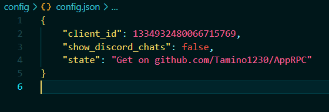
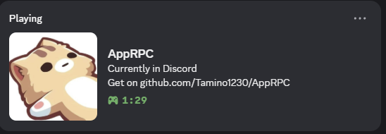
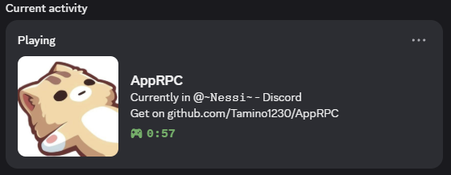

<p align="center">
  
</p>

#### This Programm a inspired program from <a href="https://github.com/Tamino1230/CustomRPC">CustomRPC</a>

# AppRPC

AppRPC is a Python application that integrates with Discord's Rich Presence, allowing you to display your current active window or desktop state on your Discord profile. It is highly configurable and easy to use, making it ideal for users who want to showcase their activity or customize their Discord status dynamically.

---

## Features

- **Discord Rich Presence Integration**: Shows your current window or desktop state on Discord.
- **Automatic Window Detection**: Updates your Discord status based on the active window title.
- **Configurable Client ID**: Easily set your Discord application's client ID.
- **Discord Chat Visibility Toggle**: Optionally hide Discord chat activity from your status.
- **Custom State Message**: Personalize the state message shown on your profile.
- **Easy Configuration**: Uses a simple JSON config file for settings.
- **Visual Feedback**: Uses `rich` for colored terminal output.

---

## Screenshots

### Configuration
<p align="center">
  
</p>

### Discord Chat Off
<p align="center">
  
</p>

### Discord Chat On
<p align="center">
  
</p>

---


## Getting Your Discord Client ID

To use AppRPC, you need a Discord Application Client ID. Here’s how to create one:

1. Go to the [Discord Developer Portal](https://discord.com/developers/applications).
2. Click **New Application** and give it a name (e.g., "AppRPC").
3. Click **Create**.
4. On the left sidebar, select **OAuth2** or **General Information**.
5. Copy the **Client ID** shown at the top.
6. Paste this Client ID into your `config/config.json` file under `client_id`.

You can also customize your application's icon and description for a more personalized experience.

---

## Installation

1. **Clone the repository**
   ```powershell
   git clone https://github.com/Tamino1230/AppRPC.git
   cd AppRPC
   ```

2. **Install dependencies**
   ```powershell
   pip install -r requirements.txt
   ```

---

## Usage

Run the application:

```powershell
python main.py
```

Your Discord status will update automatically based on your current window. The application will print status updates in the terminal.

---

## Configuration

Settings are stored in `config/config.json`. You can edit this file to change:

- `client_id`: Your Discord application's client ID.
- `show_discord_chats`: Set to `true` to show Discord chat activity, or `false` to hide it.
- `state`: Custom message to display as your status.

Example:
```json
{
    "client_id": 1334932480066715769,
    "show_discord_chats": false,
    "state": "Get on github.com/Tamino1230/AppRPC"
}
```

If the config file is missing, it will be created automatically with default settings.

---

## How It Works

- The app uses [pypresence](https://github.com/qwertyquerty/pypresence) to connect to Discord.
- It detects your current window using `win32gui` and updates your Discord status every 5 seconds.
- You can toggle whether Discord chat windows are shown in your status.
- All settings are managed via `config/config.json`.

---

## Requirements

- Python 3.12+
- [pypresence](https://pypi.org/project/pypresence/)
- [rich](https://pypi.org/project/rich/)
- [pywin32](https://pypi.org/project/pywin32/) (for `win32gui`)

---

## File Structure

```
AppRPC/
├── main.py                # Entry point
├── src/
│   ├── runtime.py         # Main AppRPC logic
│   ├── constants.py       # Config management
│   └── __init__.py
├── config/
│   └── config.json        # Configuration file
├── imgs/
│   ├── config.png         # Config screenshot
│   ├── rpc_with_discord_chat_off.png
│   └── rpc_with_discord_chat_on.png
├── requirements.txt       # Python dependencies
└── README.md
```

---

## Credits

- [pypresence](https://github.com/qwertyquerty/pypresence) for Discord RPC integration
- [rich](https://github.com/Textualize/rich) for terminal formatting

---

## License

MIT
